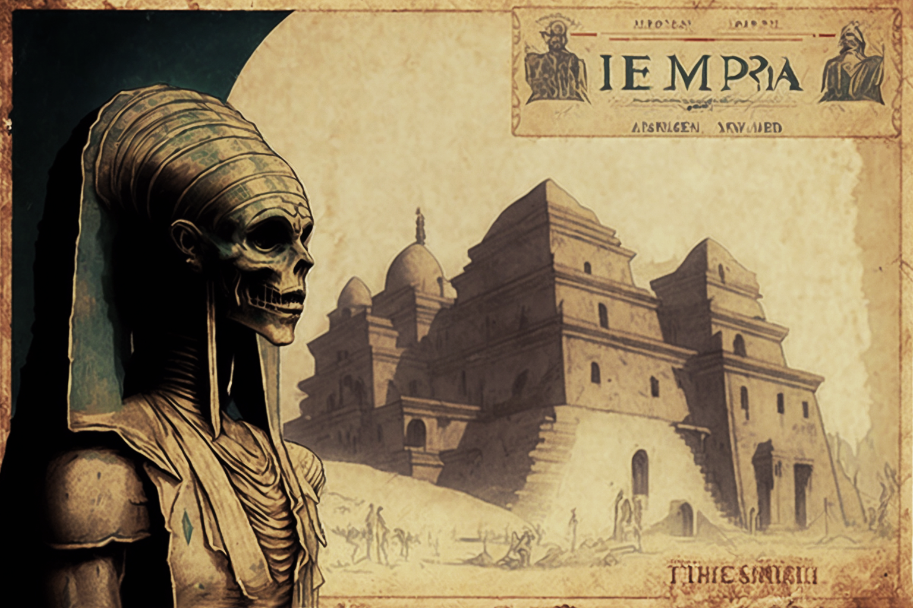

# From among the dead

<figure><figcaption></figcaption></figure>

### **The gestation of the Khepris**

Rumors had it that not only the aforementioned allegorical sculpture was saved from the fire during New Year's Eve of 1921, but also the gear machinery whose movement never ceased. Holberins managed to save it and keep it in a secure location, unknown to others. However, after his death, and over time, a legend spread that the mechanical contraption had been buried somewhere in the necropolis of Tuna el-Yebel (Hermopolis Magna of the New Kingdom of Ancient Egypt), near the Tomb of Petosiris, where a modest representation of Osiris-Khepri in the form of a bas-relief is found.

<figure><figcaption></figcaption></figure>

Its constant activity over a hundred years would have created a magical field of energy from which the first Khepris were born, who would become guardians and symbols of the city of Veel-Tark. When in 2021 the Oracles carried out the ritual, on the very ruins of Tuna el-Yebel, to open a space-time rift connecting them with the lost city of Veel-Tark, they discovered an astonishing colony of 55 Khepris in the catacombs of Petosiris' tomb. From that moment on, they would be known as the _**Primordials**_.
