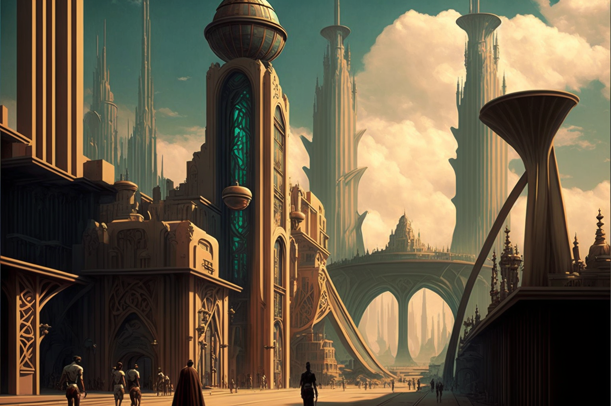

# A New Acropolis

<figure><figcaption></figcaption></figure>

### The Growth Of Veel-Tark

Initially, the city was represented on a massive game board, which was installed in one of the halls of the Bildung Complex, constructed a few years earlier by the _Sigma_ team in some location in Fribourg (Germany).

From this model, the Five Initiates gave all their collaborators citizenship cards, powers over the different spaces of the city, personalised investigative tasks, etc. In a way, the game board served as a figurative model of a space with an abstract projection in the real world. Veel-Tark existed and functioned only in the minds of the citizens, who shared the concept and the substance. It was, then, an environment sustained by the imagination of multiple minds.
