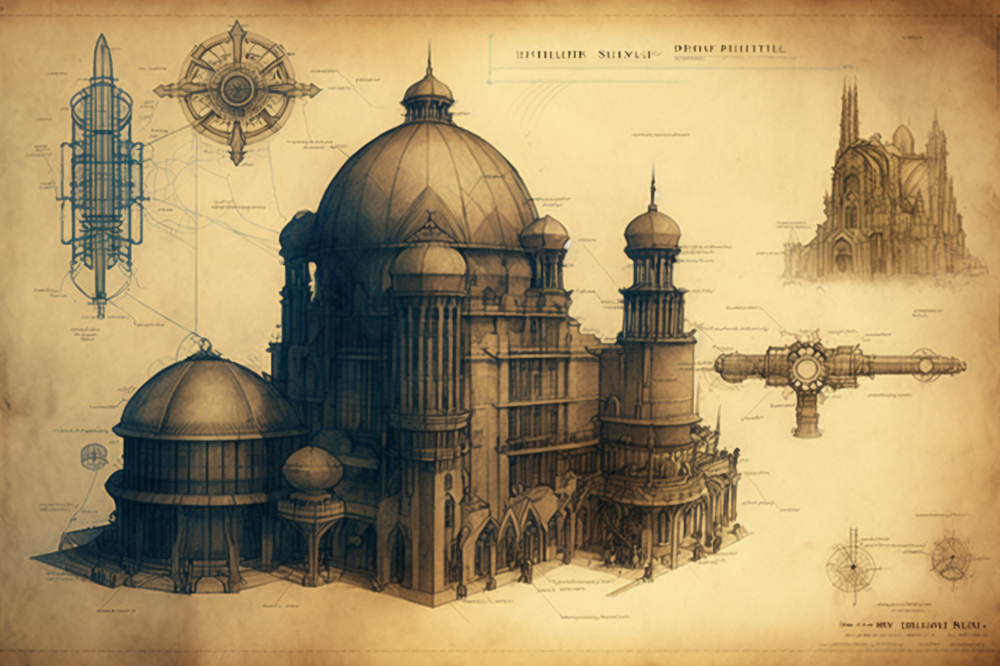

# First Movements

<figure><figcaption></figcaption></figure>

### The Search For The Agora

With the technological and social upheaval of the last third of the 19th century, and in the wake of names such as Charles Babbage, Ada Lovelace, Michael Faraday, Sophie Germain or Carl Friedrich Gauss, a wave of scientists began to become aware of the control that the privileged were trying to exert over the new cultural advances. Thus, from the work of personalities such as Max Planck, Nikola Tesla, Marie Curie, Thomas Alva Edison o John Ambrose Fleming, The Scientific Research Center _Sigma_ is born, which carries out its work in parallel with spiritualist doctrines such as Anthroposophy, Ariosophy, or Thelema, products of secret societies like the Theosophical Society, Hermetic Order of the Golden Dawn, Ordo Templi Orientis, etc. In principle, a fraternal and supportive spirit prevails, full of good intentions.

It is from this approach that the first attempt was made to bring together the knowledge and research of all these new associations into a meeting place where all paths of wisdom converge and all truths meet.

