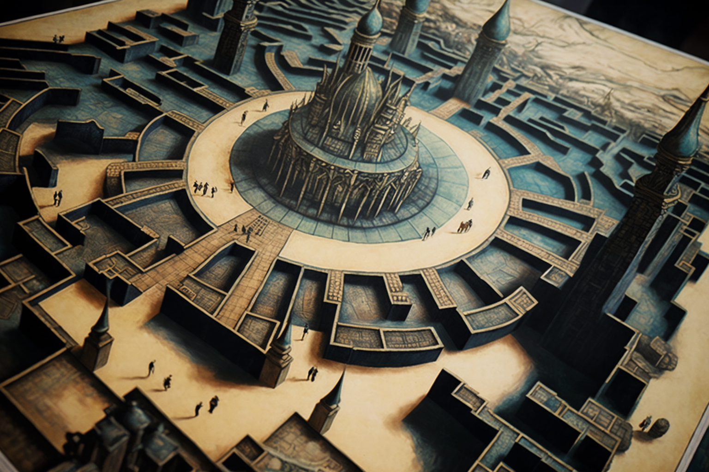

# The Creation Of The Game

<figure><figcaption></figcaption></figure>

### The Five Initiates&#x20;

Thus was born what they would begin to know, in a nod to the hermetic codes, as "The Game".

So, emulating the board of a game was how they began to conceive the idea: it was about shaping an enormous environment for universal thinking. It had to be an organized place, well-structured. With rules and proposals, just like a game; with clear and consistent purposes and objectives, just like a game. A scientific, technological, and decentralized city-state, free from the jurisdiction of the powers that kidnapped and manipulated information for their own interests.

In the year 1921, the great game board, the mythical city of Veel-Tark, was born in the hands of Five Initiates.

The names of these Five Initiates have been lost in time. We know that they were five scientists, representing different disciplines of science such as physics, mathematics, or biology, but only the nickname by which the founder of the Research Center “Sigma” was known within the game has prevailed: Holberins.

The Five Initiates established thirteen principles which they considered an unfading code of conduct: Gratitude, Self-awareness, Responsibility, Optimism, Empathy, Kindness, Tenacity, Curiosity, Patience, Conviction, Humility, Ambition, Honesty.
