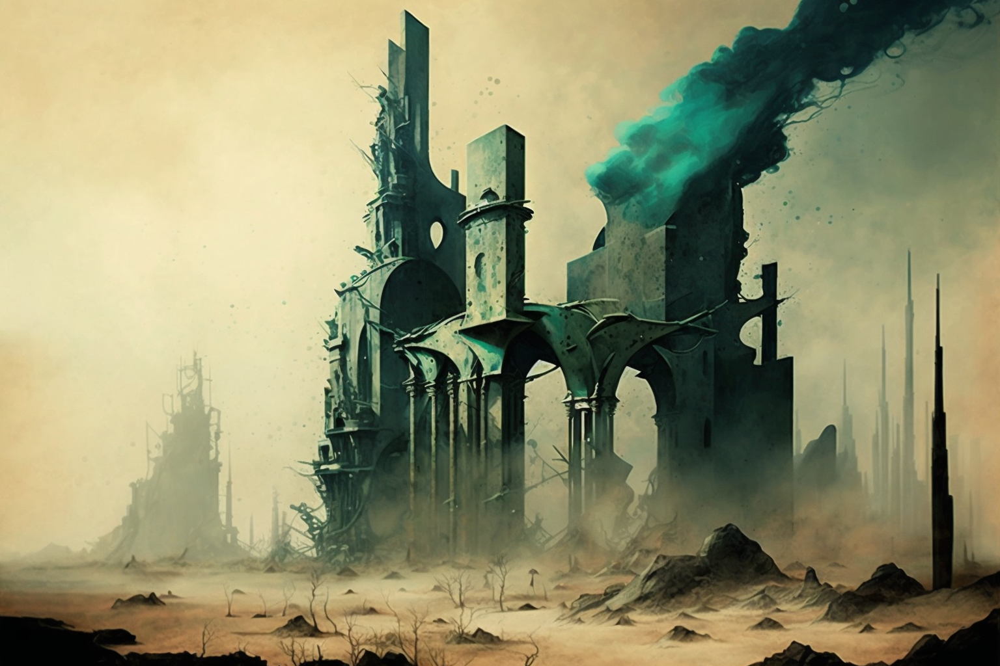

# The Fall

<figure><figcaption></figcaption></figure>

### Shadow Societies

Two of the most prominent citizens, Aleister Crowley (Thelema Society) and Rudolf von Sebottendorf (Thule Society), with their powers of persuasion, rebelled against the work of the Initiates, whom they began to brand as oligarchs, accusing them of hiding valuable secrets and knowledge to be wielded at will.

The Five Initiates removed the powers and citizen cards of the two occultists. Societies like Crowley's and Sebottendorf's, founded on selfishness and lack of values, were stigmatised.

A dark seed had germinated in the city, slowly growing among the citizens. Thus, on 31 December 1921, The Bildung Complex of the Research Center _Sigma_ burned to the ground in an arson attack. Those responsible were not found, but the flames reduced every corner of the great city to ashes, taking with it every vestige of the great project that the Five Initiates had enlightened.

However, Holberins, foreseeing the disaster, and thanks to his research in quantum physics and the findings derived from reading the _Codex Hermopolitanus_, managed to alter the flows of time to project an image of the city into a space known to the theosophists as the Akashic Records, which moved across multiple dimensions.
