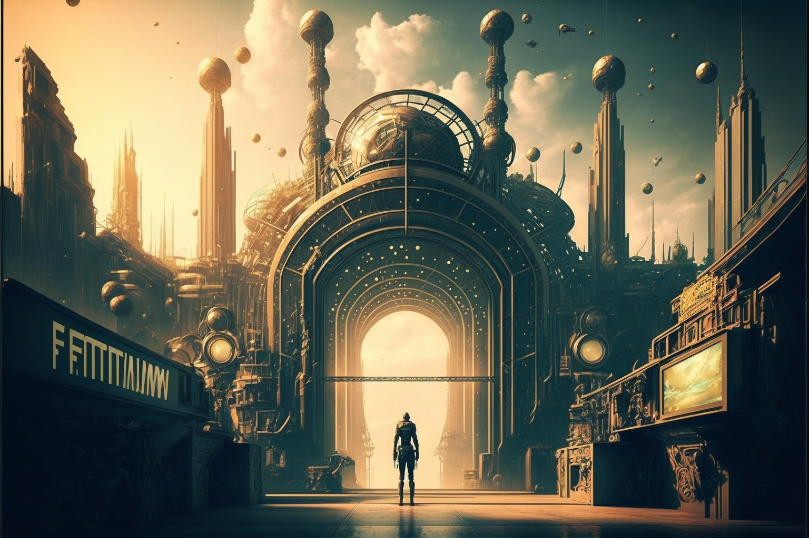

# The Rebirth

<figure><figcaption></figcaption></figure>

### The Conjunction of the Oracles

A hundred years had to pass, since its first creation, for the name Veel-Tark to be pronounced again.

In the year 2021, under the turbulent currents of the Third Industrial Revolution, within the framework of a new technological paradigm, geophysicist Alexander Reis detects a singular record in the waves of his seismograph while studying seismic movements over the tomb of Petosiris in _el-Ashmunein_ (Egypt). The strange seismogram was surprisingly similar to the oscillations obtained by mathematician Iain Stewart when iterating the formula 2x²-1 to demonstrate its chaotic behavior:

<figure><figcaption></figcaption></figure>

Reis publishes this anomaly in a modest online study, which goes completely unnoticed by the scientific community. However, it catches the attention of a group of five researchers, self-proclaimed as the Oracles, who recognize the formula used by Stewart as the same one Athanasius had turned to a hundred years earlier in the _Codex Hermopolitanus_ to develop his gear mechanism.

This group of Oracles then revives the old ideas of the five initiates, beginning to forge the rebirth of the city of Veel-Tark. Gathered near the necropolis of Tuna el-Yebel, they discover Athanasius' mechanism in full operation, and with its dynamics, they open a spacetime rift in order to find the city-state: the colossal game board that was engulfed in flames on New Year's Eve 1921, upon which the model of Veel-Tark was arranged.

The Oracles connect with the Akashic Records, located in the multidimensional space proposed by quantum physics. There, they find the residual image of Veel-Tark. Repopulating it and breathing life into it would be an arduous task. They needed to attract a large number of guilds and form new factions of knowledge to achieve it...

