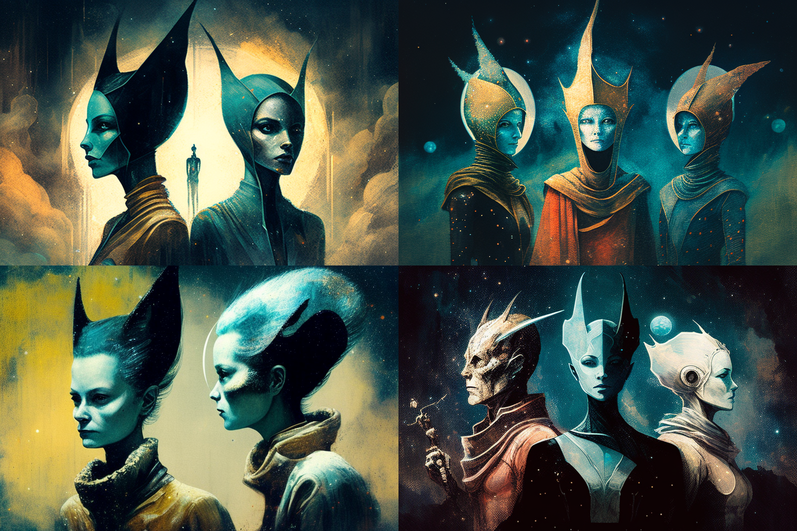

# THE RACES

<figure><figcaption></figcaption></figure>

As the records of every event, form, and space in the universe, the Akasha connects with countless fantastic and unknown worlds. When, after the fire of the Goetheanum building and the destruction of the original city, Rudolf Steiner projected its foundations into the sensitive space of the Akasha, Veel-Tark began to regenerate spontaneously, thanks to the development of the Khepris, and came into contact with many of these worlds, inhabited by races of different character. Some of these races began to inhabit the city of Veel-Tark.

Therefore, when the five oracles caused the city to emerge from the shadows in the ritual performed in the necropolis of Tuna El-Yebel, they found that these races had developed profusely in the place, for although only a hundred years had passed for the physical world, in the Akasha that time spanned unfathomable Ages. However, Veel-Tark still needed a much larger number of citizens to evolve in the metaverse, whose planes of existence are undulations of a gigantic brane that collides with the branes of other quantum spaces, recorded by the Akasha. The oracles made a call to these other worlds to repopulate the city.

Currently, there are five races that form the population of Veel-Tark.

\
